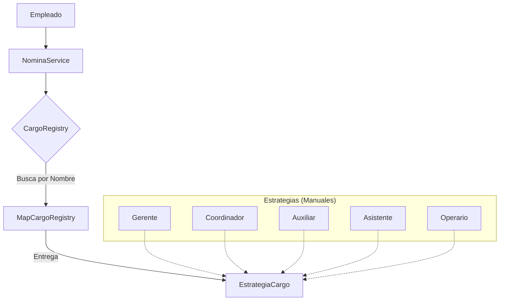

# Reto Nómina: Arquitectura Limpia y SOLID

¡Hola! Este repositorio contiene la evolución de un sistema de nómina, desde un código difícil de mantener hasta una arquitectura profesional, desacoplada y escalable.

---

## El Problema (Antes del Refactor)
Imagina que eres un **Chef** que tiene todas las recetas anotadas en una sola hoja gigante. Cada vez que llega un cliente nuevo pidiendo un plato diferente, tienes que leer toda la hoja desde el principio para encontrar qué ingredientes usar. 

En código, esto era un `NominaService` lleno de `if/else` interminables. Si queríamos añadir un cargo (como el **Auxiliar**), teníamos que romper el código que ya funcionaba para meter la nueva lógica. ¡Un peligro!

---

## La Solución: "Manuales de Bolsillo" (Patrón Strategy)

Decidimos profesionalizar la cocina. Ahora, el Chef (el sistema) no tiene una hoja gigante. Tiene un **Archivador** lleno de **Manuales de Bolsillo individuales**.

### La Analogía de "Piedras y Papel"

1.  **El Chef (NominaService)**: Sabe orquestar el proceso (calcular salud, pensión, armar el reporte), pero ya no sabe los detalles de cada cargo. Él simplemente pregunta: *"¿Qué cargo es este empleado? Traiganme su manual"*.
2.  **El Archivador (CargoRegistry)**: Es el que guarda todos los manuales. Tú le dices "AUXILIAR" y él te entrega el manual correcto.
3.  **Los Manuales (Estrategias)**: Cada cargo tiene su propio archivo (`GerenteEstrategia`, `AuxiliarEstrategia`). Ahí dice cuánto ganan y cómo se calculan sus bonos. 
    *   *¿Quieres cambiar el sueldo del Gerente?* Solo tocas el manual del Gerente. Los demás ni se enteran. 
    *   *¿Llega un cargo nuevo?* Solo imprimes un nuevo manual y lo metes al archivador.

---

## Arquitectura Visual

---

## Principios Aplicados

### 1. Open/Closed Principle (OCP)
El sistema está **abierto** a la extensión (podemos añadir 100 cargos más) pero **cerrado** a la modificación (no tenemos que volver a tocar el `NominaService` nunca más).

### 2. Alta Cohesión y Bajo Acoplamiento
Cada clase hace una sola cosa y la hace bien. El servicio no sabe cómo calcular el bono de un Gerente, y eso es bueno: delega esa responsabilidad a quien sí sabe.

### 3. Inyección de Dependencias
El `NominaService` no crea el archivador por su cuenta; lo recibe desde afuera. Esto permite que el sistema sea fácil de probar y muy flexible.

---

## Cómo ver el cambio
Para entender la diferencia, puedes saltar entre las ramas de este repositorio:
- `Reto-No-Refactoring`: El código original con los `if/else`.
- `Reto-Refactoring`: Esta versión limpia y modular.

---
*Hecho por el equipo de Arquitectura de Software - Grupo 190304005-3*
